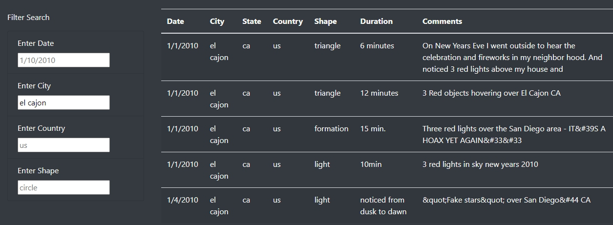

# UFO Sighting

## Overview
The main objective of this project is to be able to allow the users to apply filter across multiple criteria on the UFO sighting data.

## Results

There were 4 filter criteria (date, city, country, and shape) created to allow the users to filter the database as shown in image below. 

As users input data following the sample structure in each input field, the dataset will automatically be updated to reflect the filter criteria. As shown in below image, inputting multiple filter criteria will allow users to search for more specific UFO sighting.

## Summary

One drawback of this webpage is that the it doesn't allow for search filters on all columns of the data. With the dataset having only 2 rows where the sightings are outside of US, it would've been more advantageous to include a filter for state than a country, if given a choice. Another useful development would be to include a sorting funciton to the dataset table. Currently, the table is sorted on the date, then city in alphabetical order. Since not all filter criteria for the columns are present, sorting function may help the users to organize the data in a different way that may fit their different needs. 